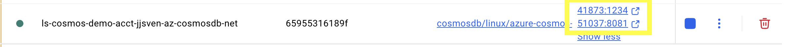

import AzureFeatureCoverage from "../../../../components/feature-coverage/AzureFeatureCoverage";

## Introduction

Azure Cosmos DB is a fully managed NoSQL database service designed for modern app development. It offers high availability, scalability, and support for multiple data models including NoSQL, MongoDB, Gremlin, and Table. For more information, see [Overview of Azure Cosmos DB](https://learn.microsoft.com/en-us/azure/cosmos-db/introduction).

LocalStack for Azure provides a local environment to build and test applications using the Cosmos DB SQL (NoSQL) API. This allows developers to iterate quickly without incurring costs or needing an active internet connection.

The supported APIs are available on our [API Coverage section](#api-coverage), which provides information on the extent of Cosmos DB's integration with LocalStack.

## Getting started

This guide is designed for users new to Azure CosmosDB and assumes basic knowledge of the Azure CLI and the `azlocal` wrapper script.

Launch LocalStack using your preferred method. Once the container is running, enable Azure CLI interception by running:

```bash
azlocal start-interception
```

This command points the `az` CLI away from the public Azure management REST API and toward the LocalStack for Azure emulator API.
To revert this configuration, run:

```bash
azlocal stop-interception
```

### Create a resource group

Create a resource group for your Cosmos DB resources:

```bash
az group create \
  --name rg-cosmos-demo \
  --location westeurope
```

```bash title="Output"
{
  "id": "/subscriptions/00000000-0000-0000-0000-000000000000/resourceGroups/rg-cosmos-demo",
  "location": "westeurope",
  "managedBy": null,
  "name": "rg-cosmos-demo",
  "properties": {
    "provisioningState": "Succeeded"
  },
  "tags": null,
  "type": "Microsoft.Resources/resourceGroups"
}
```

### Create a Cosmos DB account

Create a Cosmos DB account, the default is the NoSQL API:

```bash
az cosmosdb create \
  --name cosmos-demo-acct \
  --resource-group rg-cosmos-demo \
  --locations regionName=westeurope failoverPriority=0 \
  --default-consistency-level Session
```

```bash title="Output"
{
  "analyticalStorageConfiguration": {
    "schemaType": "WellDefined"
  },
  "apiProperties": null,
  "backupPolicy": {
    "migrationState": null,
    "periodicModeProperties": {
      "backupIntervalInMinutes": 240,
      "backupRetentionIntervalInHours": 8,
      "backupStorageRedundancy": "Geo"
    },
    "type": "Periodic"
  },
  "capabilities": [],
  "capacity": null,
  "capacityMode": null,
  "capacityModeChangeTransitionState": null,
  "connectorOffer": null,
  "consistencyPolicy": {
    "defaultConsistencyLevel": "Session",
    "maxIntervalInSeconds": 5,
    "maxStalenessPrefix": 100
  },
  "cors": [],
  "createMode": null,
  "customerManagedKeyStatus": null,
  "databaseAccountOfferType": "Standard",
  "defaultIdentity": "FirstPartyIdentity",
  "defaultPriorityLevel": "High",
  "diagnosticLogSettings": null,
  "disableKeyBasedMetadataWriteAccess": false,
  "disableLocalAuth": false,
  "documentEndpoint": "https://cosmos-demo-acct.documents.azure.com:8081/",
  "enableAllVersionsAndDeletesChangeFeed": null,
  "enableAnalyticalStorage": false,
  "enableAutomaticFailover": true,
  "enableBurstCapacity": false,
  "enableCassandraConnector": null,
  "enableFreeTier": false,
  "enableMaterializedViews": null,
  "enableMultipleWriteLocations": false,
  "enablePartitionMerge": false,
  "enablePerRegionPerPartitionAutoscale": true,
  "enablePriorityBasedExecution": false,
  "failoverPolicies": [
    {
      "failoverPriority": 0,
      "id": "cosmos-demo-acct-westeurope",
      "locationName": "West Europe"
    }
  ],
  "id": "/subscriptions/00000000-0000-0000-0000-000000000000/resourceGroups/rg-cosmos-demo/providers/Microsoft.DocumentDB/databaseAccounts/cosmos-demo-acct",
  "identity": {
    "principalId": null,
    "tenantId": null,
    "type": "None",
    "userAssignedIdentities": null
  },
  "instanceId": "<function uuid4 at 0x103cbb600>",
  "ipRules": [],
  "isVirtualNetworkFilterEnabled": false,
  "keyVaultKeyUri": null,
  "keyVaultKeyUriVersion": null,
  "keysMetadata": {
    "primaryMasterKey": {
      "generationTime": "2026-04-15T11:32:21.177624+00:00"
    },
    "primaryReadonlyMasterKey": {
      "generationTime": "2026-04-15T11:32:21.177624+00:00"
    },
    "secondaryMasterKey": {
      "generationTime": "2026-04-15T11:32:21.177624+00:00"
    },
    "secondaryReadonlyMasterKey": {
      "generationTime": "2026-04-15T11:32:21.177624+00:00"
    }
  },
  "kind": "GlobalDocumentDB",
  "location": "West Europe",
  "locations": [
    {
      "documentEndpoint": "https://cosmos-demo-acct-westeurope.documents.azure.com:8081/",
      "failoverPriority": 0,
      "id": "cosmos-demo-acct-westeurope",
      "isZoneRedundant": false,
      "locationName": "West Europe",
      "provisioningState": "Succeeded"
    }
  ],
  "minimalTlsVersion": "Tls12",
  "name": "cosmos-demo-acct",
  "networkAclBypass": "None",
  "networkAclBypassResourceIds": [],
  "privateEndpointConnections": null,
  "provisioningState": "Succeeded",
  "publicNetworkAccess": "Enabled",
  "readLocations": [
    {
      "documentEndpoint": "https://cosmos-demo-acct-westeurope.documents.azure.com:8081/",
      "failoverPriority": 0,
      "id": "cosmos-demo-acct-westeurope",
      "isZoneRedundant": false,
      "locationName": "West Europe",
      "provisioningState": "Succeeded"
    }
  ],
  "resourceGroup": "rg-cosmos-demo",
  "restoreParameters": null,
  "systemData": {
    "createdAt": "2026-04-15T11:31:49.177624+00:00",
    "createdBy": null,
    "createdByType": null,
    "lastModifiedAt": null,
    "lastModifiedBy": null,
    "lastModifiedByType": null
  },
  "tags": {},
  "throughputPoolDedicatedRUs": null,
  "throughputPoolMaxConsumableRUs": null,
  "type": "Microsoft.DocumentDB/databaseAccounts",
  "virtualNetworkRules": [],
  "writeLocations": [
    {
      "documentEndpoint": "https://cosmos-demo-acct-westeurope.documents.azure.com:8081/",
      "failoverPriority": 0,
      "id": "cosmos-demo-acct-westeurope",
      "isZoneRedundant": false,
      "locationName": "West Europe",
      "provisioningState": "Succeeded"
    }
  ]
}
````

### Authentication

There are two primary ways to authenticate against the Cosmos DB emulator in LocalStack:

#### Account key

Retrieve the primary master key and use it in your application's connection settings:

```bash
az cosmosdb keys list \
  --name cosmos-demo-acct \
  --resource-group rg-cosmos-demo \
  --query "primaryMasterKey"
```

```bash title="Output"
"C2y6yDjf5/R+ob0N8A7Cgv30VRDJIWEHLM+4QDU5DE2nQ9nDuVTqobD4b8mGGyPMbIZnqyMsEcaGQy67XIw/Jw=="
```

#### Connection string

Retrieve a full connection string that can be used directly with the Azure Cosmos DB SDKs:

```bash
az cosmosdb keys list \
  --type connection-strings \
  --name cosmos-demo-acct \
  --resource-group rg-cosmos-demo \
  --query "connectionStrings[0].connectionString"
```

### Manage Databases and Containers

#### Create a SQL database

```bash
az cosmosdb sql database create \
  --account-name cosmos-demo-acct \
  --resource-group rg-cosmos-demo \
  --name MyDatabase
```

```bash title="Output"
{
  "id": "/subscriptions/00000000-0000-0000-0000-000000000000/resourceGroups/rg-cosmos-demo/providers/Microsoft.DocumentDB/databaseAccounts/cosmos-demo-acct/sqlDatabases/MyDatabase",
  "location": null,
  "name": "MyDatabase",
  "options": null,
  "resource": {
    "colls": "colls/",
    "createMode": null,
    "etag": "\"51a78949-e34e-46bd-b8ed-1fc534dc1e67\"",
    "id": "MyDatabase",
    "restoreParameters": null,
    "rid": "MDAwMQ==",
    "ts": 1776253581.0,
    "users": "users/"
  },
  "resourceGroup": "rg-cosmos-demo",
  "tags": null,
  "type": "Microsoft.DocumentDB/databaseAccounts/sqlDatabases"
}
```

#### Create a container with a partition key:

```bash
az cosmosdb sql container create \
  --account-name cosmos-demo-acct \
  --resource-group rg-cosmos-demo \
  --database-name MyDatabase \
  --name MyContainer \
  --partition-key-path "/partitionKey" \
  --throughput 400
```

```bash title="Output"
{
  "id": "/subscriptions/00000000-0000-0000-0000-000000000000/resourceGroups/rg-cosmos-demo/providers/Microsoft.DocumentDB/databaseAccounts/cosmos-demo-acct/sqlDatabases/MyDatabase/containers/MyContainer",
  "identity": null,
  "location": null,
  "name": "MyContainer",
  "options": null,
  "resource": {
    "analyticalStorageTtl": null,
    "clientEncryptionPolicy": null,
    "computedProperties": [],
    "conflictResolutionPolicy": {
      "conflictResolutionPath": "/_ts",
      "conflictResolutionProcedure": "",
      "mode": "LastWriterWins"
    },
    "createMode": null,
    "dataMaskingPolicy": null,
    "defaultTtl": null,
    "etag": "37a1e18f-222a-4c45-9ea7-55e982ed18a0",
    "fullTextPolicy": null,
    "id": "MyContainer",
    "indexingPolicy": {
      "automatic": true,
      "compositeIndexes": [],
      "excludedPaths": [
        {
          "path": "/\"_etag\"/?"
        }
      ],
      "fullTextIndexes": [],
      "includedPaths": [
        {
          "indexes": null,
          "path": "/*"
        }
      ],
      "indexingMode": "consistent",
      "spatialIndexes": [],
      "vectorIndexes": null
    },
    "materializedViewDefinition": null,
    "materializedViews": null,
    "materializedViewsProperties": null,
    "partitionKey": {
      "kind": "Hash",
      "paths": [
        "/partitionKey"
      ],
      "systemKey": null,
      "version": null
    },
    "restoreParameters": null,
    "rid": "MDAwMQ==",
    "ts": 1776253628.0,
    "uniqueKeyPolicy": {
      "uniqueKeys": []
    },
    "vectorEmbeddingPolicy": null
  },
  "resourceGroup": "rg-cosmos-demo",
  "tags": null,
  "type": "Microsoft.DocumentDB/databaseAccounts/sqlDatabases/containers"
}
```

### Emulator container and Data Explorer

The emulator is comprised of two components:
- **Data explorer** - interactively explore the data in the emulator. This runs on the local port mapped to the container's port 1234
- **Azure Cosmos DB emulator** - a local version of the Azure Cosmos DB database service. This runs on the local port mapped to the container's port 8081.



## Features

The Cosmos DB emulator supports the following features:

- **Resource Management**: Create, update, and delete accounts, databases, and containers via ARM templates or CLI.

- **SQL (NoSQL) API**: Full support for CRUD operations, queries, and stored procedures.

- **Fixed Master Key**: Supports the standard well-known master key for ease of local configuration.

- **Instant Provisioning**: Accounts and resources are available immediately upon creation commands.

## Limitations

- **Consistency Models**: While multiple consistency levels can be configured, the local environment behaves as 'Session' consistency by default.

- **API Support**: Only the API for NoSQL and API for MongoDB are supported. Cassandra, Gremlin, and Table APIs are currently unavailable.

- **Throughput Modes**: Only provisioned throughput is supported; serverless throughput mode is not available.

- **Key Management**: The master key is fixed upon startup and cannot be regenerated during runtime.

- **Scaling and Replication**: Geo-replication, multi-region configurations, and horizontal scaling (scaling out) are not supported.

- **Multi-region Simulation**: While you can specify multiple locations, traffic is routed to the local instance, and there is no true geographic latency simulation.

- **Infrastructure-as-Code**: Bicep and Terraform deployments are planned, but not supported at this time.

## Samples

The following samples demonstrate how to use Cosmos DB with LocalStack for Azure:

- [Azure CosmosDB NoSQL API Sample with LocalStack for Azure](https://github.com/localstack/localstack-azure-samples/tree/main/samples/web-app-cosmosdb-nosql-api/python)

## API Coverage

<AzureFeatureCoverage service="Microsoft.DocumentDB" client:load />